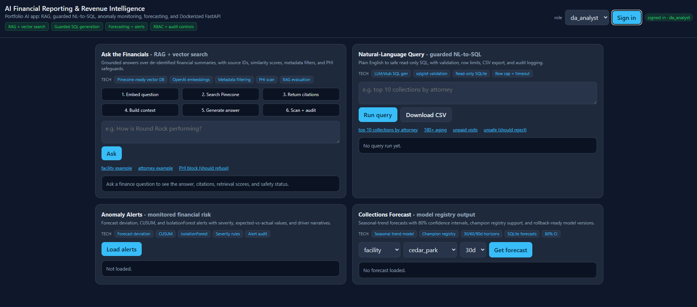

# AI-Powered Financial Reporting & Revenue Intelligence Platform

## Portfolio Case Study: Production-Style AI Financial Assistant

This project demonstrates an AI Applications Developer workflow: building a
secure AI-powered financial assistant in **Python** from data pipelines through
retrieval, LLM synthesis, API delivery, evaluation, and deployment. It is served
by a **FastAPI** + **Uvicorn** gateway with **Pydantic** v2 validation, does ML
with **NumPy**, **pandas**, and **scikit-learn** over **SQLite** and **Parquet**
(**PyArrow**) data zones, performs RAG synthesis with **OpenAI** (GPT-4o, with an
offline stub fallback and an **Azure OpenAI** seam) over **OpenAI embeddings**
retrieved from **Pinecone** or an in-memory vector store, guards **NL-to-SQL**
with **sqlglot**, secures access via **PyJWT** (JWT/RBAC) and HMAC-SHA256 PHI
tokenization, ships a vanilla HTML/CSS/JS dashboard, is tested with **pytest**,
and is containerized with **Docker** for deployment on **Render** (backend) and
**Netlify** (frontend).

**Live demo:** [financial.tomnguyen.me](https://financial.tomnguyen.me)
(Render free tier — the first request after idle may take ~30–50s to wake.)



### Role Alignment

| Job requirement | Evidence in this project |
|---|---|
| AI-powered features | RAG chatbot, NL-to-SQL, forecasting, anomaly detection |
| Backend APIs | FastAPI gateway with RBAC-protected endpoints |
| Embeddings/vector DB | OpenAI embeddings with Pinecone-ready vector retrieval |
| Data pipelines | Synthetic ingestion, feature store, forecasts, alerts |
| Privacy/security | PHI scanning, HMAC tokenization, RBAC, audit logging |
| Evaluation | RAG evaluation harness for citations, refusals, latency |
| DevOps | Dockerfile, Render (Docker) backend + Netlify frontend, env-based config |
| Documentation | Architecture notes, implementation notes, demo instructions |

A **local runnable MVP** of the platform described in the planning docs
(`01`–`04_*.md`). Six modules behind one FastAPI gateway, with real ML logic,
PHI safeguards, JWT/RBAC, and append-only audit. Azure services are abstracted
behind seams and substituted with local equivalents (see
`implementation-notes.md` for the full substitution table and every decision
made along the way).

## Modules

| # | Module | What it does |
|---|--------|--------------|
| 1 | Ingestion | Synthetic OData source → validation → PHI masking → raw/curated parquet → SQLite |
| 2 | Feature store | 5 feature groups, point-in-time retrieval, freshness tracking |
| 3 | Forecasting | Seasonal-trend forecaster, walk-forward MAPE, champion/challenger registry + rollback |
| 4 | Anomaly detection | CUSUM + IsolationForest + forecast-deviation, severity, grounded driver narratives, Slack-style alerts |
| 5 | RAG chatbot | "Ask the Financials" over de-identified aggregates only, citations, similarity gate, PHI scans |
| 6 | NL-to-SQL | LLM SQL generation, sqlglot safety validation, read-only execution, CSV export |

## Requirements

- Python 3.11+ (developed on 3.14; the Docker image pins 3.12)
- Install deps:

```bash
pip install -r requirements.txt
```

`openai` is optional. With **no `OPENAI_API_KEY`**, the platform runs fully
offline using a deterministic LLM stub + hash embedder (audit logs record
`model="stub"`). Set a key to use real GPT-4o-class synthesis / embeddings.

## Configuration

Copy the example env and edit as needed (all values have safe local defaults):

```bash
cp .env.example .env
```

Key vars: `JWT_SECRET`, `PHI_HMAC_KEY`, `OPENAI_API_KEY` (blank = stub),
`OPENAI_MODEL`, `AZURE_OPENAI_*`, `SLACK_WEBHOOK_URL`, `SYNTH_MONTHS`, `SYNTH_SEED`.

### Pinecone RAG Mode

Local development defaults to `VECTOR_STORE=memory`. For the portfolio deployment:

```bash
OPENAI_API_KEY=...
OPENAI_EMBED_MODEL=text-embedding-3-small
VECTOR_STORE=pinecone
PINECONE_API_KEY=...
PINECONE_INDEX_NAME=financial-rag-demo
EMBEDDING_DIMENSION=1536
```

Build the Pinecone index:

```bash
python -m scripts.seed_data
python -m scripts.build_pinecone_index
```

## Quick start

```bash
# 1. Populate the platform (schema → ingest → features → train → forecast → detect)
python -m scripts.seed_data

# 2. Run the API
python -m app.main          # serves http://127.0.0.1:8000  (Swagger at /docs)

# 3. Get a dev token, then call any endpoint
curl -X POST http://127.0.0.1:8000/auth/token \
     -H "Content-Type: application/json" \
     -d '{"user_id":"alice","role":"da_analyst"}'
```

## API surface

| Method | Path | Capability | Notes |
|--------|------|-----------|-------|
| POST | `/auth/token` | — | Dev token issuer (stands in for Entra ID) |
| GET  | `/health` | — | Liveness |
| GET  | `/forecasts/entities` | `forecasts:read` | List forecastable entities |
| GET  | `/forecasts/{type}/{id}` | `forecasts:read` | Forecast with 80% CI |
| GET  | `/alerts` | `alerts:read` | Anomaly alerts (filter by severity/status) |
| POST | `/alerts/{id}/acknowledge` | `alerts:write` | Acknowledge an alert |
| POST | `/chatbot/ask` | `chatbot:use` | RAG Q&A with citations + PHI scans |
| POST | `/nl2sql/query` | `nl2sql:use` | NL → safe SQL → result preview |
| POST | `/nl2sql/export` | `nl2sql:use` | Same query as CSV download |
| GET  | `/admin/models/{name}` | `admin` | Model registry view |
| POST | `/admin/models/{name}/rollback/{version}` | `admin` | One-call rollback |
| GET  | `/admin/freshness` | `admin` | Feature freshness + SLA breaches |

Roles: `collections`, `finance`, `da_analyst`, `admin` (capability matrix in
`app/security/auth.py`).

## Nightly batch

```bash
python -m scripts.run_nightly   # ingest → features → forecast → detect, per-stage timing
```

## RAG Evaluation

Run a small portfolio evaluation suite:

```bash
python -m scripts.evaluate_rag
```

The evaluator checks whether safe questions return citations, PHI-style
questions are blocked, and responses stay within acceptable latency.

## Tests

```bash
python -m pytest tests/ -q     # security, NL-to-SQL safety, API/RBAC integration
```

## Deployment (live demo)

The platform runs as a single Docker container — FastAPI serves both the API and
the dashboard. It needs **no external database and no API keys**: on startup it
seeds deterministic synthetic data and serves the dashboard, so it runs anywhere
the `Dockerfile` does.

**Backend — Render (Docker), free tier:**

1. New → Web Service → connect this repo → Render auto-detects the `Dockerfile`
   → instance type **Free**.
2. Set environment variables (never commit these):
   - `JWT_SECRET`, `PHI_HMAC_KEY` — long random strings
   - `CORS_ALLOW_ORIGINS` — your frontend origin, e.g. `https://yoursite.netlify.app`
   - `VECTOR_STORE=memory` (default; set `pinecone` + keys to use a managed vector DB)
   - `OPENAI_API_KEY` — optional; blank runs the offline stub
3. Health check path: `/health`.

The app binds `0.0.0.0:$PORT` and re-seeds synthetic data on boot when the
(ephemeral) database is empty, so no persistent disk is required. Set
`SEED_ON_STARTUP=0` to skip the boot-time seed.

**Frontend — Netlify (static):** set `BACKEND_URL` in `app/static/index.html` to the
deployed backend URL (no trailing slash), then publish `index.html`. The page talks
same-origin only on `localhost`/`127.0.0.1` (local dev served by FastAPI); on any
other host it calls `BACKEND_URL`. Make sure `CORS_ALLOW_ORIGINS` on the backend
matches the Netlify origin exactly (scheme + host, no trailing slash).

> Ingestion is synthetic-only in this public build — no production database,
> client schema, or real data is included anywhere in the repo.

## Project layout

```
app/
  config.py, db.py            # settings + SQLite layer (read/write + read-only roles)
  security/                   # phi (HMAC tokenize + scanners), auth (JWT/RBAC), audit
  ingestion/                  # synthetic OData, schemas, quality, pipeline
  features/                   # definitions, compute, store
  forecasting/                # models, registry (champion/challenger), service
  anomaly/                    # detectors, severity, alerting
  llm/                        # OpenAI/Azure client + deterministic offline stub
  rag/                        # corpus (aggregates only), vector index, chatbot
  nl2sql/                     # glossary, validator, generator, executor
  routers/                    # FastAPI routers per module
  main.py                     # gateway: CORS, rate limit, request logging, RBAC
config/                       # thresholds.yaml, glossary.yaml (operator-editable)
scripts/                      # seed_data.py, run_nightly.py
tests/                        # pytest suite
implementation-notes.md       # decisions, deviations, tradeoffs (read this!)
```

## Security notes

- **PHI never leaves the curated boundary tokenized.** HMAC-SHA256 tokenization at
  ingest; RAG corpus is built from aggregates only; chatbot scans input and output.
- **NL-to-SQL is doubly sandboxed:** sqlglot SELECT-only + table whitelist *and* a
  read-only SQLite connection (`mode=ro` + `PRAGMA query_only`).
- **Every model/chatbot/SQL action is audited** (append-only `audit_log`).
- The shipped default secrets are for local dev only — replace them in production
  (in the real deployment they come from Azure Key Vault).
